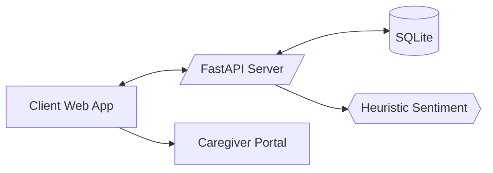

# Architecture

- **FastAPI backend** exposes REST endpoints for users, memories, reminders, and chat.
- **SQLite** (via SQLAlchemy) for simple persistence.
- **Client (vanilla JS)** calls the API and provides a minimalistic chat UI and CRUD for memories/reminders.
- **Sentiment module** provides lightweight, dependency-free polarity detection.
- **Corpus** holds JSONL datasets used for training/fine-tuning or prompting templates.

## Security & Privacy (Demo)
- No PII is uploaded externally by default.
- Use `.env` to set secrets; defaults are safe for local development.
- For production, use HTTPS, JWT auth, and an external KMS/Vault.
